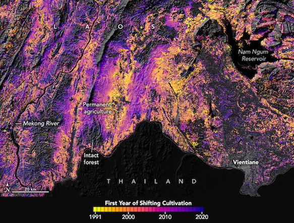

# **Contribution to Nasa Mission: Pale Blue Dot Visualization Challenge**

 Get Involved With NASA. We invite members of the public to contribute their time and expertise to advancing research, solving problems, and potentially winning prizes as a result of their work.

## Problem description

Your goal in this challenge is to create a visualization using Earth observation data that advances at least one of the following Sustainable Development Goals (SDGs):

- Zero Hunger
- Clean Water and Sanitation
- Climate Action

  

This competition does not require advanced technical or coding skills. Participants at all skill levels are welcome!

## Getting started

### Steps to create a basic submission:

Identify a dataset to use, and decide how you'll access it. See the data section for detailed requirements.
For an overview of possible datasets to use, check out the data resources blog post. Find a dataset you are interested in, and follow the steps in one of the tutorials linked under "Getting started".
To identify more publicly available datasets for specific issues you're interested in, check out NASA's Data Pathfinders page. There are pathfinders for a variety of issues, from water quality to agriculture. Each pathfinder provides an overview of datasets relevant to the issue and information about how to access each one.
Identify a decision or action that this dataset could inform, and that has an impact on at least one of they key competition SDGs (zero hunger, clean water and sanitation, climate action).
Create your visualization! There are no specific technical requirements. For example, any of the below would be a valid way to create a submission:
Use Python to access data through an API and generate an interactive visualization using Python
Download the data, load it into an Excel sheet, and create a visualization in Excel
Many, many more!
Write up a short summary of your visual, per the submission format.
Zip up your summary with an image of your visual! If you'd like to be considered for the Best Overall prize, make sure to include a detailed report too.

For more inspiration, check out some examples of how Earth observation data can further the SDGs. Or get started by joining one of the participant live tutorials.

### Data

Your visualization must use at least one publicly available Earth observation dataset collected by a U.S. government agency. "Earth observation data" means observations about the Earth collected in space, such as satellite data, airborne, and in-situ sensors. The data resources blog post suggests some datasets that satisfy this requirement. However, it is not a comprehensive list and we encourage you to explore other datasets too. If you are unsure whether a specific dataset meets this requirements, just ask! Head over to the competition forum to post questions and to find teammates.

You may access each dataset however you like, as long as the access method is freely available and does not require a paid subscription. For example, using third-party tools like Microsoft's Planetary Computer to access data programmatically is allowed. Downloading data manually from U.S. government repositories is also allowed.

### Supplementary data

You may use any additional datasets, regardless of whether they are Earth observation data, as long as they are publicly and freely available. However, you must ensure that you have the correct rights and permissions to use and share each additional dataset. To do this, you can usually check the license under which the data is shared.

The Guide to Open Science from NASA's Transform to Open Science (TOPS) mission has a useful guide to licenses, including both choosing licenses for your own work and understanding other licenses.

Link[Link](link.com)
