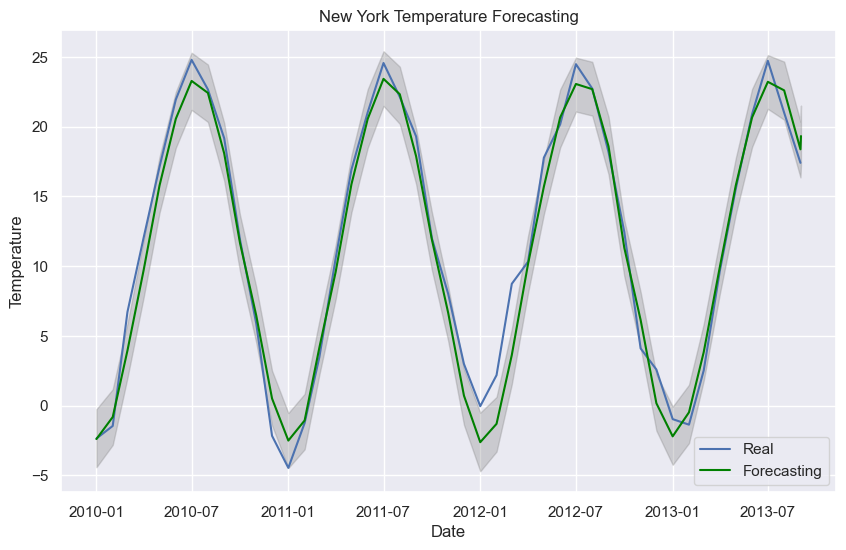
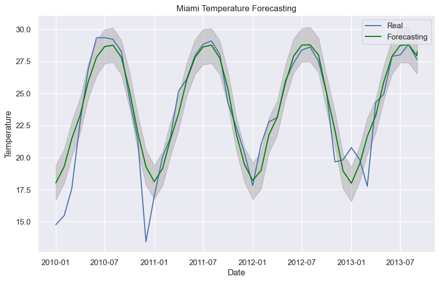
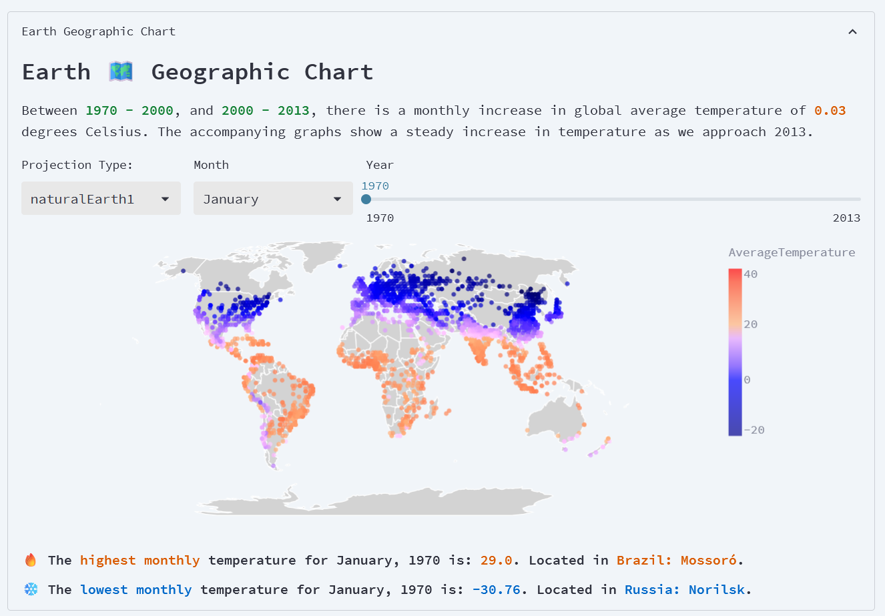
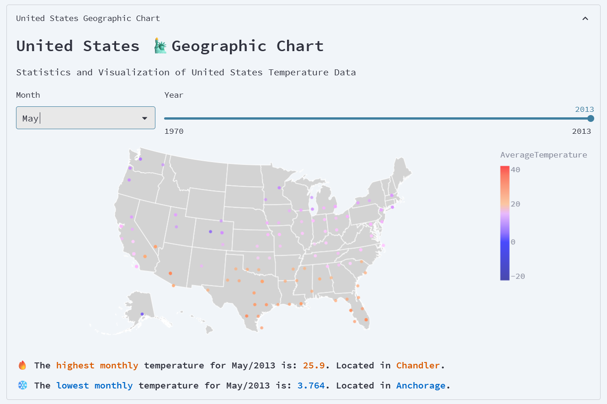
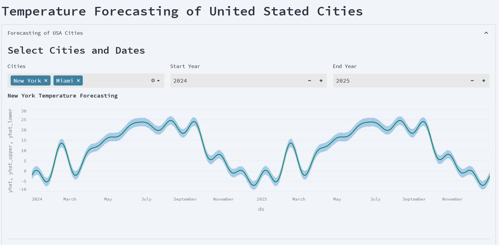

# 🪐NASA's Pale Blue Dot 🌎 Mission: World Temperature Viewer 🌡️

The NASA Pale Blue Dot Visualization Challenge is a contest that encourages individuals from various fields to create innovative data visualizations using Earth observation data. This initiative was launched as part of the Open Science Year 2023 celebration and NASA’s new Transform to Open Science (TOPS) initiative. The challenge aims to advance at least one of the following Sustainable Development Goals (SDGs): Zero Hunger, Clean Water and Sanitation, and Climate Action. Participants have the opportunity to be part of the open science revolution by unlocking the full potential of Earth observation data, which provides accurate and publicly accessible information about our atmosphere, oceans, ecosystems, land cover, and built environment

---

**By:** Jorge Felix Martínez Pazos

**From:** Center for Computational Mathematics Studies. University of Informatics Sciences.

---

## Introduction

The escalating threat of global warming and climate change, driven by humanity's current trend toward consumerism, deliberate consumption of natural resources, and emission of atmospheric toxins, is a pressing issue. Despite the adoption of renewable energy by many companies, significant change will not be realized until humanity fully acknowledges the impending reality of this problem. Our solution to the Pale Blue Dot challenge focuses on the  Sustainable  Development  Goal:  Climate Action.  We have  extensively  studied  and analyzed the Earth's land surface temperature using an open-source dataset published inKaggleby Berkeley Earth: [https://www.kaggle.com/datasets/berkeleyearth/climate-change-earth-surface-temperature-data.](https://www.kaggle.com/datasets/berkeleyearth/climate-change-earth-surface-temperature-data)

## Overview

The World Temperature Viewer (WTV) is our contribution to NASA’s Pale Blue Dot mission. This application leverages data analysis and data science techniques to provide insights into the past and prospective behavior of Land Surface Temperature across the Earth. The software includes a set of models using the Meta AI Prophet Framework to perform robust temperature forecasting for U.S cities. The dataset used is the Global Land Temperature By City, published by Berkeley Earth on Kaggle.

The (WTV) also integrates a comprehensive data analysis resulting in graphical representations, geographic charts, and descriptive statistics that provide powerful insights into the behavior of temperatures on Earth. This interactive exploration not only demystifies the abstract concepts often associated with these phenomena but also highlights their tangible, real-world impacts.

## Methodology

The dataset was split into a training set (1970 to 2013) and a test set (2010 to 2013). The model was trained using the Prophet framework with the following parameters:

```python
{
    'growth': 'linear',    
    'seasonality_mode': 'additive',   
    'seasonality_prior_scale': 10.0,   
    'holidays_prior_scale': 10.0,  
    'changepoint_prior_scale': 0.05,   
    'mcmc_samples': 0,      
    'interval_width': 0.8,  
    'uncertainty_samples': 1000,   
    'stan_backend': None
}
```

After training, the model’s performance was evaluated over the test set, reporting robust values for Average Mean Absolute Error (1.3) and Average Mean Squared Error (7.1) across all models. The comparison between observed values and forecasted values for New York and Miami is represented below.





Our solution underscores the importance of data-driven decision-making in addressing the pressing issue of climate change. By providing a platform that translates rich climate data into actionable insights, we aim to facilitate informed discussions and decisions about sustainable practices and policies.

The **World Temperature Viewer**, a part of NASA’s Pale Blue Dot mission, is available on Streamlit Cloud. This interactive application uses data science techniques to visualize global temperature trends. It’s user-friendly, accessible worldwide, and continuously updated for relevance. The application translates complex climate data into easy-to-understand visualizations, aiding in climate change awareness and understanding.

***World Temperature Viewer:*** [https://nasa-palebluedot-wtv.streamlit.app/](https://nasa-palebluedot-wtv.streamlit.app/)







## Further Information

For an in-depth comprehension of the project, it is recommended to refer to the subsequent resources located within the Pale Blue Dot Solution directory: ‘**Summary**’, ‘**Detailed Report**’, and ‘**Solution Notebook**’. These documents provide extensive information and insights about the project.

## Feedback

Your feedback is greatly appreciated! Feel free to follow the author on the following platforms:

- **LinkedIn:** [https://www.linkedin.com/in/wisegeorgie/](https://www.linkedin.com/in/wisegeorgie/)
- **Medium:** [https://medium.com/@jorgefmp.mle](https://medium.com/@jorgefmp.mle)
- **ResearchGate:** [https://www.researchgate.net/profile/Jorge-Martinez-205](https://www.researchgate.net/profile/Jorge-Martinez-205)

Your support and follow are much appreciated!
